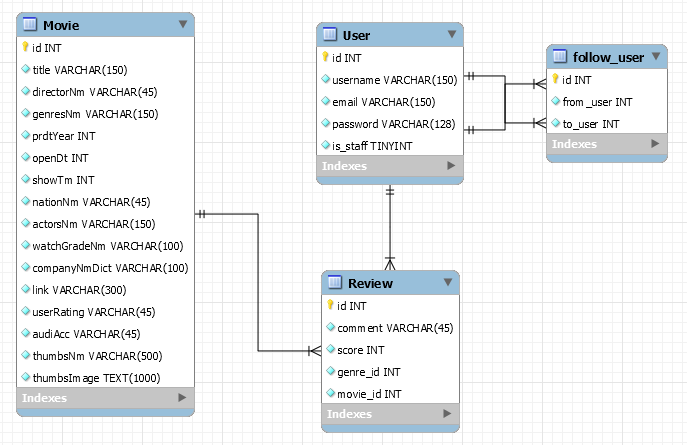

# Final_Project

## 1. 팀원 정보 및 업무 분담 내역

- 김윤재: DB 모델링, 추천 알고리즘 구현

- 배성호: 뷰 컴포넌트 구성 및 구현

- 이한얼: 영화 데이터 크롤링 및 정제, Django 기반 DB 모델링 및 데이터 적용, 추천 알고리즘 일부 구현

  

## 2. 목표 서비스 구현 및 실제 구현 정도

- 영화 추천 서비스 구현

- 개발 아키텍처: Django REST API 서버(djangorestframework) + VueJS(Node, SFC)

- Version

  - Python: 3.8.0

  - Django: 2.2.6
  - Djangorestframework: 3.10.3
  - Vue: 2.6.10
  - Vue-router: 3.1.3
  - Vue-session: 1.0.0
  - Vuetify: 2.1.11
  - V-animate-css: 0.0.3
  - Axios: 0.19.0
  - Core-js: 3.3.2
  - Jwt-decode: 2.2.0

- 유저의 최신 영화 선택에 따라 적절한 추억의 영화 추천

- 일자별 업무 진행 정도

  - 11/21(목): 조 편성 및 프로젝트 주제 선정, 기획
  - 11/22(금): 역할 분담, 필요한 자료 수집, 계획 수립
  - 11/23(토)~24(일): 영진위, 네이버 영화 API 분석, DB 모델링, Vue 컴포넌트 구조 설계
  - 11/25(월): 회원가입, 로그인, 로그아웃 구현
  - 11/26(화): 관리자 페이지 구현
  - 11/27(수): 유저의 영화 선택, 추천 알고리즘 구현
  - 11/28(목): 최적화, 디버깅, 에러페이지 구성

## 3. 데이터베이스 모델링(ERD)

## 4. 핵심 기능

- 영화 추천

  - 사용자에게 임의의 영화 선택지를 제공
  - 유저의 영화 선택에 따라 DB의 영화들 각각에 추천 점수를 계산하고, 옛날 추억의 영화를 추천
  - 추억의 영화와 함께 관련 OST, 예고편, 하이라이트 영상 등 음악과 영상 관련 정보 제공 

- 추천 알고리즘

  - 군집화, 중복 제거를 통해 사용자의 선호도를 파악할 수 있고, 겹치지 않게 영화 선택지를 제공
  - 유저가 선택한 영화의 속성들에 따라 데이터에 있는 영화들의 추천 점수를 계산해서 최적의 영화를 추천

- 관리자 페이지

  - 일반 유저와는 권한이 다른 관리자를 설정
  - 관리자 페이지를 통한 영화, 유저 정보 관리

- 리뷰 작성

  - 로그인 한 유저는 평점과 코멘트 등록, 수정, 삭제 가능
  - 평점과 코멘트를 남긴 영화는 다음번 추천 리스트에 뜨지 않음

- 데이터 수집

  - 최신 영화들 중 대중적이고 인기있던 영화 데이터를 통해 사용자에게 보여줄 영화 선택지에 활용
  - 80, 90, 00년대 인기가 있었던 영화를 수집해 추억의 영화 추천

- UI/UX

  - Vuetify 라이브러리를 이용해 어플리케이션에 최적화된 디자인 구현
  - Single Page App으로 페이지 리로드 최소화

  

## 5. 배포 서버 URL

## 기타 (느낀점)

일주일 동안 주로 Django(백엔드)를 맡아 프로그램을 구현했습니다. 프로젝트를 진행하면서 데이터를 수집, 적용하는 파트와 프론트엔드와의 상호작용적인 부분에서 백엔드는 가교 역할을 한다고 느꼈습니다. 때문에 데이터의 종류, 양, 목표 서비스를 고려해 모델링을 하고, 프론트엔드의 요청을 받아 이에 맞는 응답을 보내줄 때 해당 파트의 팀원들과 많은 의사소통을 하려고 노력했던 것 같습니다. 또한, 추천 알고리즘을 여러 구현하는 방식에 대해서 알아볼 수 있었고, 완성도는 조금 떨어지지만 content-based filtering 방식을 통해 유저의 영화 선택에 따른 영화 추천 알고리즘을 작성해볼 수 있었습니다. 이후에는, colloabrative filtering 방식, 혹은 두 방식이 결합된 hybrid filtering 방식을 구현해 유저의 과거 행동 데이터를 통해 영화를 추천하는 방법을 구현해보고 싶습니다.