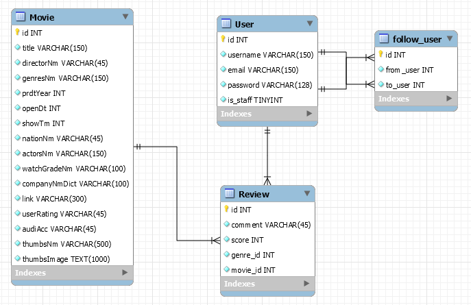

# Final_Project

## 1. 팀원 정보 및 업무 분담 내역

- 김윤재: DB 모델링, 추천 알고리즘 구현

- 배성호: 뷰 컴포넌트 구성 및 구현

- 이한얼: 영화 데이터 수집 및 DB 적용

  

## 2. 목표 서비스 구현 및 실제 구현 정도

- 영화 추천 서비스 구현

- 개발 아키텍처: Django REST API 서버(djangorestframework) + VueJS(Node, SFC)

- Version

  - Python: 3.8.0

  - Django: 2.2.6
  - Djangorestframework: 3.10.3
  - Vue: 2.6.10
  - Vue-router: 3.1.3
  - Vue-session: 1.0.0
  - Vuetify: 2.1.11
  - V-animate-css: 0.0.3
  - Axios: 0.19.0
  - Core-js: 3.3.2
  - Jwt-decode: 2.2.0

- 유저의 최신 영화 선택에 따라 적절한 추억의 영화 추천

- 일자별 업무 진행 정도

  - 11/21(목): 조 편성 및 프로젝트 주제 선정, 기획
  - 11/22(금): 역할 분담, 필요한 자료 수집, 계획 수립
  - 11/23(토)~24(일): 영진위, 네이버 영화 API 분석, DB 모델링, Vue 컴포넌트 구조 설계
  - 11/25(월): 회원가입, 로그인, 로그아웃 구현
  - 11/26(화): 관리자 페이지 구현
  - 11/27(수): 유저의 영화 선택, 추천 알고리즘 구현
  - 11/28(목): 최적화, 디버깅, 에러페이지 구성

## 3. 데이터 추출 및 데이터베이스 모델링(ERD)

- 데이터 추출 과정 

  - 영화진흥위원회 및 NAVER API를 활용하여 뽑을 수 있는 데이터를 추출 및 결합, 이외에 추가로 필요한 데이터는 NAVER 영화 상세페이지 크롤링
    - bs4 라이브러리를 활용하여 데이터 크롤링
      - select( 'div.poster > a > div > div'),   for문으로 추출
      - **.select_one('.#') ,** Beautifulsoup()로 다시 형변환 후 제공

- 에러 처리

  - request 요청 시 에러
    - 통신할 때 reqeust를 너무 빠르게 보낸 경우에러 갑자기 다운 되는 경우
      - sleep()로 시간을 조정
    - 일정하게 여러번 보낼 때 에러가 발생하기도 함.
      -  request 보낼 때 기본 0.1초~0.16초로 랜덤 시간에 따라 진행
        - seed(time.random())
        - time.random()으로 작성

  - 예외처리 사례 (예외 처리할 것들이 너무 많다! : try, except 구문으로 예외처리하고 로그 남겨 분석하기!)
    - 영화 진흥원과 Naver 영화 API 정보가 연동이 되지 않는 경우
      - 검색 키워드인 제목이 저마다 다르거나, 같은 제목의 여러 영화들이 있는 문제점
        - 제작연도, 감독 등 다른 추가 정보를 통해 연동을 시도
        - translator(), ord()를 활용해 글자 이외의 모든 문자를 삭제해주고 검색결과를 비교
    - 내용이 없는 경우
      - try: ~ except: 예외처리를 통해 로그에 기록하고 어떤 부분이 문제인지 분석
      - 규칙을 찾을 수 없으면 제외
    - 제목, 줄거리에 이상한 문자들이 삽입 되어 있는 경우
      - translator(), ord()를 활용해 글자 단위로 제거
      - .replace()를 활용해 불필요 문자들 제거 (제목에서 ` `, ` ` 등 각종 태그들을 모두 제거  등 (.replace('` `, '' ) )

- 데이터베이스 모델링

  - 개발한 영화 추천 서비스에서 모든 page를 랜더링 및 라우팅 할 때 쓸 모든 자료들을 추출하고, Django Model을  구성하여 필요 데이터를 SQLite에 연동

## 4. 핵심 기능

- 영화 추천

  - 사용자에게 임의의 영화 선택지를 제공
  - 유저의 영화 선택에 따라 DB의 영화들 각각에 추천 점수를 계산하고, 옛날 추억의 영화를 추천
  - 추억의 영화와 함께 관련 OST, 예고편, 하이라이트 영상 등 음악과 영상 관련 정보 제공 

- 추천 알고리즘

  - 군집화, 중복 제거를 통해 사용자의 선호도를 파악할 수 있고, 겹치지 않게 영화 선택지를 제공
  - 유저가 선택한 영화의 속성들에 따라 데이터에 있는 영화들의 추천 점수를 계산해서 최적의 영화를 추천

- 관리자 페이지

  - 일반 유저와는 권한이 다른 관리자를 설정
  - 관리자 페이지를 통한 영화, 유저 정보 관리

- 리뷰 작성

  - 로그인 한 유저는 평점과 코멘트 등록, 수정, 삭제 가능
  - 평점과 코멘트를 남긴 영화는 다음번 추천 리스트에 뜨지 않음

- 데이터 수집

  - 최신 영화들 중 대중적이고 인기있던 영화 데이터를 통해 사용자에게 보여줄 영화 선택지에 활용
  - 80, 90, 00년대 인기가 있었던 영화를 수집해 추억의 영화 추천

- UI/UX

  - Vuetify 라이브러리를 이용해 어플리케이션에 최적화된 디자인 구현
  - Single Page App으로 페이지 리로드 최소화

  

## 5. 배포 서버 URL

## 기타 (느낀점)

- 김윤재

   일주일 동안 주로 Django(백엔드)를 맡아 프로그램을 구현했습니다. 프로젝트를 진행하면서 데이터를 수집, 적용하는 파트와 프론트엔드와의 상호작용적인 부분에서 백엔드는 가교 역할을 한다고 느꼈습니다. 때문에 데이터의 종류, 양, 목표 서비스를 고려해 모델링을 하고, 프론트엔드의 요청을 받아 이에 맞는 응답을 보내줄 때 해당 파트의 팀원들과 많은 의사소통을 하려고 노력했던 것 같습니다. 또한, 추천 알고리즘을 여러 구현하는 방식에 대해서 알아볼 수 있었고, 완성도는 조금 떨어지지만 content-based filtering 방식을 통해 유저의 영화 선택에 따른 영화 추천 알고리즘을 작성해볼 수 있었습니다. 이후에는, colloabrative filtering 방식, 혹은 두 방식이 결합된 hybrid filtering 방식을 구현해 유저의 과거 행동 데이터를 통해 영화를 추천하는 방법을 구현해보고 싶습니다.

- 배성호

- 이한얼

  주로 페이지에서 사용자에게 어떤 정보를 제공할 것인지, 어떤 사용자 경험을 제공할 것인지 기획했습니다. 데이터를 추출하고 정제하여 Django DB에 연동하는 자동화 모듈을 구현했습니다. 프로젝트를 진행하면서 추천 시스템의 개발에 있어서 사용자 데이터의 수집이 절실하게 필요함을 절감했습니다. API를 통해서 크롤링이나 가져올 수 있는 데이터들을 가져와서 사용할 수는 있었습니다. 하지만 결과들을 피상적으로 사용하는 것 이외에 보다 새로운 서비스를 위해서 활용하기 위해서는 데이터 수집 방식, 여러 알고리즘이나, 머신러닝, 딥 러닝 등의 활용 방법에 대한 고민이 필요하다는 생각이 듭니다. 대규모의 유저들로부터 데이터를 받아온다고 하면 시간 및 비용 효율성을 향상시키기 위해서 데이터 어떤 형식으로 받아올지, 어떻게 쿼리를 구성할지에 대한 고민이 필요함을 느꼈습니다.